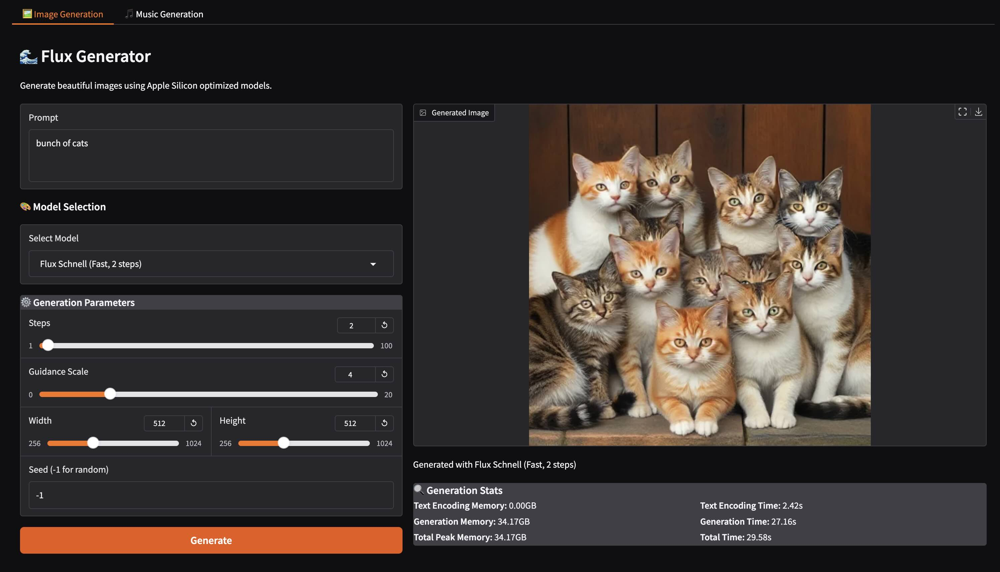
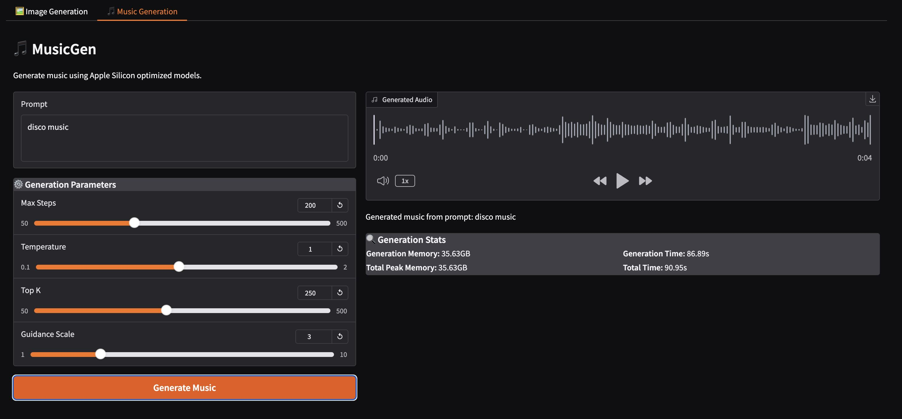

# Flux Generator: macOS MLX-Powered Image & Music Generation with Open WebUI compatable API for Image generation

## Features

- Text-to-image generation
- Text-to-music generation (NEW!)
- Multiple model options:
  - Image Generation:
    - black-forest-labs Flux schnell/dev
    - stabilityai sdxl-turbo/stable-diffusion-2-1
  - Music Generation:
    - facebook/musicgen-medium
- Customizable image size and generation parameters
- Advanced music generation controls
- Memory usage reporting
- API compatibility for Image generation for third-party UIs like Open WebUI
- Unified server for both UI and API
- Configurable network access modes

## Optimized for Apple Silicon with MLX

This repository utilizes the MLX framework, designed specifically for Apple Silicon, to provide optimized performance for:
- Black Forest Flux and Stable Diffusion image generation
- Facebook's MusicGen audio generation

MLX leverages the unified memory architecture of Apple's M-series chips, enabling faster and more efficient computations.

### Why MLX?

* **Performance:** Experience significant speed improvements compared to other frameworks on Apple Silicon.
* **Local Execution:** Run Stable Diffusion models locally on your Mac, ensuring data privacy and enabling offline use.
* **Fine-Tuning:** MLX provides a great environment for fine-tuning models on apple silicon.

For more examples of what MLX can do, check out the official mlx-examples repository: [https://github.com/ml-explore/mlx-examples](https://github.com/ml-explore/mlx-examples)

This repository is designed to give apple silicon users a fast and easy way to generate images locally.

## UI Screenshots:




## Example Generation

Here's an example image generated using the Flux model:


Prompt: "a beautiful moonset over the ocean, highly detailed, 4k"
Parameters:
- Model: schnell
- Size: 512x512
- Steps: 2
- CFG Scale: 4.0

## Requirements

- macOS with Apple Silicon (M1/M2/M3)
- Python 3.10+ (tested with python3.11)
- MLX framework
- Additional audio processing libraries for MusicGen

## Installation & Usage

### Quick Start (Recommended)

The easiest way to run Flux Generator is using the provided script:

```bash
# Make the script executable
chmod +x run_flux.sh

# Run in local-only mode (most secure)
./run_flux.sh

# Or run with network access (for remote access)
./run_flux.sh --network
```

The script will:
- Check if you're running on Apple Silicon Mac
- Create and set up a Python virtual environment
- Install all required dependencies
- Check for existing model files
- Start the server based on the selected mode

### Script Options

```bash
Usage: ./run_flux.sh [OPTIONS]

Options:
  -h, --help         Show this help message
  -n, --network      Enable network access (less secure)

Examples:
  ./run_flux.sh                 # Run in local-only mode (most secure)
  ./run_flux.sh --network       # Run with network access (for remote access)
```

### Access Modes

1. **Local Only (Default, Most Secure)**
   ```bash
   ./run_flux.sh
   ```
   - Only allows connections from localhost (127.0.0.1)
   - Best for local development and testing
   - Access via: http://127.0.0.1:7860

2. **Network Access**
   ```bash
   ./run_flux.sh --network
   ```
   - Allows connections from any network interface
   - Required for Docker integration
   - Less secure, use only in trusted networks
   - Access via:
     - Local: http://127.0.0.1:7860
     - Network: http://0.0.0.0:7860
     - Docker: http://host.docker.internal:7860

### Manual Installation

If you prefer to set things up manually:

1. **Create a virtual environment:**
   ```bash
   python3.11 -m venv venv
   
   # For bash/zsh:
   source venv/bin/activate
   
   # For fish:
   source venv/bin/activate.fish
   ```

2. **Install requirements:**
   ```bash
   pip install -r requirements.txt
   ```

3. **Run the server:**
   ```bash
   # For local use only (most secure):
   python3.11 flux_app.py

   # For network access (remote):
   python3.11 flux_app.py --listen-all
   ```

### Command Line Options

```bash
python3.11 flux_app.py [OPTIONS]

Options:
  --port INTEGER       Port to run the server on (default: 7860)
  --listen-all        Listen on all network interfaces (0.0.0.0)
  --help              Show this message and exit
```

### Command Line Interface
For command-line image generation:

```bash
python3.11 txt2image.py --model schnell \
--n-images 1 \
--image-size 512x512 \
--verbose \
'A photo of an astronaut riding a horse on a beach.'
```

## Using the Web Interface

Once the server is running (either via `run_flux.sh` or manually):

1. Open your browser and navigate to http://127.0.0.1:7860
2. Choose your desired generation mode:
   - 🖼️ Image Generation: Enter a prompt, select a model and click generate
   - 🎵 Music Generation: Enter a music description and adjust parameters
3. On first use, models will be downloaded:
   - Image models: approximately 30 GB
   - MusicGen model: approximately 3.5 GB
4. Download progress will be visible in the terminal
5. Once downloaded, generation will begin

### Image Generation Parameters

- Model: schnell
- Size: 512x512
- Steps: 2
- CFG Scale: 4.0

### Music Generation Parameters

The music generation interface provides several parameters to control the output:

- **Max Steps**: Controls the length of the generated audio (50-500)
- **Temperature**: Controls randomness in generation (0.1-2.0)
- **Top K**: Controls diversity of the output (50-500)
- **Guidance Scale**: Controls how closely to follow the prompt (1.0-10.0)

## API Integration

The application provides an API that can be used with third-party UIs like Open WebUI.
Check this tutorial for Open WebUI integration instructions:
[Tutorial](https://voipnuggets.com/2025/02/18/flux-generator-local-image-generation-on-apple-silicon-with-open-webui-integration-using-flux-llm/
)

### Integration with Open WebUI

Since Flux Generator requires direct access to Apple Silicon hardware, it runs natively on your Mac while Open WebUI can run in Docker:

1. Start Flux Generator with network access:
   ```bash
   ./run_flux.sh
   ```
   or
   ```bash
   ./run_flux.sh --network
   ```
   This will start the server and listen on all interfaces (--network flag required for Docker integration if running on a different machine).

2. Run Open WebUI in Docker:
   ```bash
   docker run -d \
     -p 3000:8080 \
     --add-host=host.docker.internal:host-gateway \
     -e AUTOMATIC1111_BASE_URL=http://host.docker.internal:7860/ \
     -e ENABLE_IMAGE_GENERATION=True \
     -v open-webui:/app/backend/data \
     --name open-webui \
     --restart always \
     ghcr.io/open-webui/open-webui:main
   ```

3. Access Open WebUI at `http://localhost:3000`

The connection flow works like this:
```
Open WebUI (Docker Container) -> host.docker.internal:7860 -> Flux Generator (Native on Mac)
```

This setup ensures:
- Flux Generator has direct access to Apple Silicon for optimal performance
- Open WebUI runs in an isolated container
- Both services communicate seamlessly through Docker's networking

### Available Endpoints

1. `/sdapi/v1/txt2img` (POST)
   - Generate images from text
   - Parameters:
     ```json
     {
       "prompt": "your prompt here",
       "negative_prompt": "",
       "width": 512,
       "height": 512,
       "steps": 2,
       "cfg_scale": 4.0,
       "batch_size": 1,
       "n_iter": 1,
       "seed": -1,
       "model": "schnell"
     }
     ```

2. `/sdapi/v1/sd-models` (GET)
   - List available models
   - Returns Flux Schnell and Dev models

3. `/sdapi/v1/options` (GET/POST)
   - Get or set generation options
   - Includes model settings and parameters

4. `/sdapi/v1/progress` (GET)
   - Get generation progress information

### Example API Usage

Here's a Python example to generate images:

```python
import requests
import json
import base64

# Use appropriate URL based on your setup:
# Local only:      "http://127.0.0.1:7860"
url = "http://127.0.0.1:7860/sdapi/v1/txt2img"

payload = {
    "prompt": "a beautiful sunset over the ocean, highly detailed, 4k",
    "width": 512,
    "height": 512,
    "steps": 2,
    "cfg_scale": 4.0,
    "batch_size": 1,
    "n_iter": 1,
    "seed": 42,
    "model": "schnell"
}

response = requests.post(url, json=payload)
result = response.json()

# Save the generated image
if result["images"]:
    image_data = base64.b64decode(result["images"][0].split(",")[1])
    with open("generated_image.png", "wb") as f:
        f.write(image_data)
```

## Model Management

The Flux server requires model files to be downloaded before use. You can download the models in several ways:

1. Automatic download on first use:
   - Models will be downloaded automatically when you first try to generate
   - The download progress will be visible in the CLI/terminal
   - This may cause a delay on your first generation

2. Using HuggingFace CLI (Recommended for faster downloads):

   ```bash
   # Install the HuggingFace CLI
   pip install -U "huggingface_hub[cli]"

   # You can also install the CLI using Homebrew:
   brew install huggingface-cli

   # Install hf_transfer for blazingly fast speeds
   pip install hf_transfer

   # Login to your HF account
   huggingface-cli login

   # Download Schnell model
   huggingface-cli download black-forest-labs/FLUX.1-schnell

   # Download Dev model (optional)
   huggingface-cli download black-forest-labs/FLUX.1-dev

   # Download MusicGen model
   huggingface-cli download facebook/musicgen-medium
   ```

3. Using the command-line interface:
   Note: Each Flux model is approximately 24GB in size, the SD models are bigger. The download includes:
   - Model weights (flux1-{model}.safetensors)
   - Autoencoder (ae.safetensors)
   - Text encoders and tokenizers
   
   # Download command for all models
   ```bash
   huggingface-cli download black-forest-labs/FLUX.1-schnell
   huggingface-cli download black-forest-labs/FLUX.1-dev (needs to ask for access, follow the onscreen instructions when you run this command)
   huggingface-cli download stabilityai/stable-diffusion-2-1-base
   huggingface-cli download stabilityai/sdxl-turbo
   huggingface-cli download facebook/musicgen-medium
   ```

Model Repos:
https://huggingface.co/black-forest-labs/FLUX.1-schnell
https://huggingface.co/black-forest-labs/FLUX.1-dev
https://huggingface.co/stabilityai/stable-diffusion-2-1-base
https://huggingface.co/stabilityai/sdxl-turbo
https://huggingface.co/facebook/musicgen-medium

Model files are stored in the HuggingFace cache directory (`~/.cache/huggingface/hub/`).

## Buy Me a Coffee

👋 Hi, I'm Akash Gupta! Here's what I work on:

• 🚀 **Current Project**: Flux Generator - MLX-powered image generation for Apple Silicon
  - Local image generation using Apple's MLX framework
  - Beautiful Gradio UI with real-time stats
  - API compatible with Open WebUI
  - Memory-efficient design for M1/M2/M3 Macs

• 💼 **Professional Background**:
  - Sr. Voice Over IP Engineer
  - Expert in Kamailio and open-source VoIP
  - Cloud integration specialist
  - Learning LLMOps

• 🌐 **Community Contributions**:
  - Blog: [voipnuggets.com](https://voipnuggets.com)
  - Focus: VoIP technology & AI advancements
  - Regular tutorials and technical guides

If you find this project helpful, consider supporting my work:


[☕ Buy Me a Coffee](https://buymeacoffee.com/akashg)
