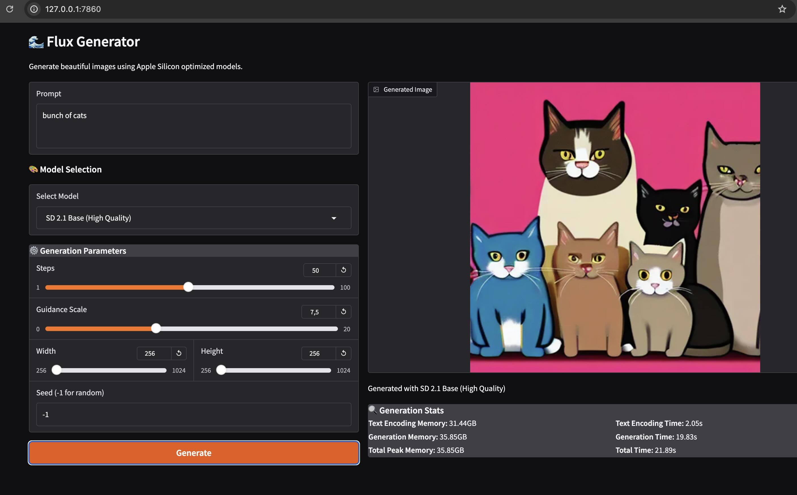

# Flux Generator: macOS MLX-Powered Image Generation with Open WebUI compatable API
This repository is based on the Flux example from this repository.
https://github.com/ml-explore/mlx-examples/tree/main/flux

## Features

- Text-to-image generation
- Multiple model options (schnell/dev)
- Customizable image size and generation parameters
- Memory usage reporting
- API compatibility for third-party UIs like Open WebUI
- Unified server for both UI and API
- Configurable network access modes

## Screenshots:


## Example Generation

Here's an example image generated using the Flux model:


Prompt: "a beautiful moonset over the ocean, highly detailed, 4k"
Parameters:
- Model: schnell
- Size: 512x512
- Steps: 2
- CFG Scale: 4.0

## Requirements

- macOS with Apple Silicon (M1/M2/M3)
- Python 3.10+ (tested with python3.11)
- MLX framework

## Installation

```bash
python3.11 -m venv venv
source venv/bin/activate
pip install -r requirements.txt
```

## Usage

Run the unified server with both UI and API:
```bash
# For local use only (most secure):
python3.11 flux_app.py

# For all network access (including Docker):
python3.11 flux_app.py --listen-all
```

### Command Line Options

```bash
python3.11 flux_app.py [OPTIONS]

Options:
  --port INTEGER       Port to run the server on (default: 7860)
  --listen-all        Listen on all network interfaces (0.0.0.0)
  --help              Show this message and exit
```

### Command Line Interface
For command-line image generation:

```bash
python3.11 txt2image.py --model schnell \
--n-images 1 \
--image-size 512x512 \
--verbose \
'A photo of an astronaut riding a horse on a beach.'
```
## Generating image uising the flux generator UI

- The UI is accessable here http://127.0.0.1:7860
- Enter a prompt and click generate buttons
- On the first use the model will get downloaded which is about 23 GB in size
- The downloaded status is visible on the terminal
- Once the model is downloaded the image generation will start


## API Integration

The application provides an API that can be used with third-party UIs like Open WebUI.
Check this tutorial for Open WebUI integration instructions:
https://voipnuggets.com/2025/02/18/flux-generator-local-image-generation-on-apple-silicon-with-open-webui-integration-using-flux-llm/

### Starting the Server

The server supports two access modes with different security levels:

1. Local Only (Most Secure):
   ```bash
   python3.11 flux_app.py
   ```
   - Only allows connections from localhost (127.0.0.1)
   - Best for local development and testing
   - Not accessible from Docker or other machines

2. All Networks:
   ```bash
   python3.11 flux_app.py --listen-all
   ```
   - Allows connections from any network interface
   - Required for Docker integration
   - Less secure, use only in trusted networks

The server will start on port 7860 (configurable with `--port`).

### Docker Integration with Open WebUI

1. Start the Flux server on your host machine:
   ```bash
   python3.11 flux_app.py --listen-all
   ```
   Note: Docker integration requires `--listen-all` to allow container access.

2. Run Open WebUI in Docker:
   ```bash
   docker run -d -p 3000:8080 \
     --add-host=host.docker.internal:host-gateway \
     -e AUTOMATIC1111_BASE_URL=http://host.docker.internal:7860/ \
     -e ENABLE_IMAGE_GENERATION=True \
     -v open-webui:/app/backend/data \
     --name open-webui \
     --restart always \
     ghcr.io/open-webui/open-webui:main
   ```

3. Access Open WebUI at `http://localhost:3000`

The connection flow works like this:
```
Open WebUI (Docker Container) -> host.docker.internal:7860 -> Flux API (Host Machine)
```

This setup runs the resource-intensive model natively on your Mac while the UI runs in Docker.

### Available Endpoints

1. `/sdapi/v1/txt2img` (POST)
   - Generate images from text
   - Parameters:
     ```json
     {
       "prompt": "your prompt here",
       "negative_prompt": "",
       "width": 512,
       "height": 512,
       "steps": 2,
       "cfg_scale": 4.0,
       "batch_size": 1,
       "n_iter": 1,
       "seed": -1,
       "model": "schnell"
     }
     ```

2. `/sdapi/v1/sd-models` (GET)
   - List available models
   - Returns Flux Schnell and Dev models

3. `/sdapi/v1/options` (GET/POST)
   - Get or set generation options
   - Includes model settings and parameters

4. `/sdapi/v1/progress` (GET)
   - Get generation progress information

### Example API Usage

Here's a Python example to generate images:

```python
import requests
import json
import base64

# Use appropriate URL based on your setup:
# Local only:      "http://127.0.0.1:7860"
# Local network:   "http://192.168.1.1:7860"
# Docker:          "http://host.docker.internal:7860"
url = "http://127.0.0.1:7860/sdapi/v1/txt2img"

payload = {
    "prompt": "a beautiful sunset over the ocean, highly detailed, 4k",
    "width": 512,
    "height": 512,
    "steps": 2,
    "cfg_scale": 4.0,
    "batch_size": 1,
    "n_iter": 1,
    "seed": 42,
    "model": "schnell"
}

response = requests.post(url, json=payload)
result = response.json()

# Save the generated image
if result["images"]:
    image_data = base64.b64decode(result["images"][0].split(",")[1])
    with open("generated_image.png", "wb") as f:
        f.write(image_data)
```

## Model Management

The Flux server requires model files to be downloaded before use. You can download the models in several ways:

1. Automatic download on first use:
   - Models will be downloaded automatically when you first try to generate an image
   - The download progress will be visible in the CLI/terminal
   - This may cause a delay on your first generation

2. Using HuggingFace CLI (Recommended for faster downloads):

   ```bash
   # Install the HuggingFace CLI
   pip install -U "huggingface_hub[cli]"

   # Install hf_transfer for blazingly fast speeds
   pip install hf_transfer

   # Login to your HF account
   huggingface-cli login
   
   # Enable fast downloads
   export HF_HUB_ENABLE_HF_TRANSFER=1

   # Download Schnell model
   huggingface-cli download black-forest-labs/FLUX.1-schnell

   # Download Dev model (optional)
   huggingface-cli download black-forest-labs/FLUX.1-dev
   ```

   Note: Each model is approximately 24GB in size. The download includes:
   - Model weights (flux1-{model}.safetensors)
   - Autoencoder (ae.safetensors)
   - Text encoders and tokenizers

3. Using the command-line interface:
   ```bash
   # This will download the model if not present locally
   python3.11 txt2image.py --model schnell --steps 1 --verbose "A photo of an astronaut riding a horse on Mars."
   ```
   - The download progress will be shown in the terminal
   - After download completes, it will generate the image

Model files are stored in the HuggingFace cache directory (`~/.cache/huggingface/hub/`).